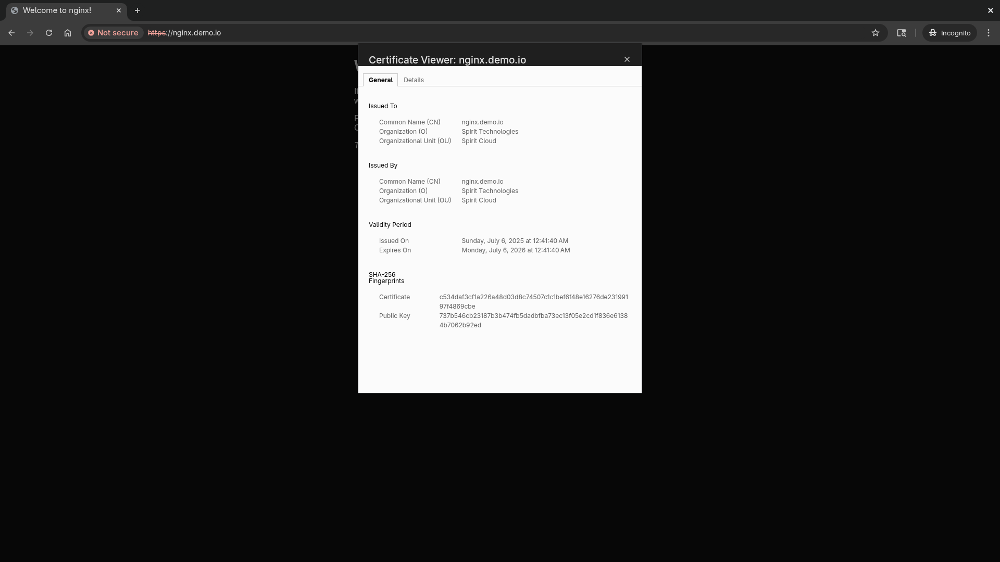

# setup_kubernetes_cluster

Setup a Kubernetes cluster with MongoDB, Mongo Express, Nginx, Prometheus, and Grafana

## Minikube Commands

Create a minikube cluster:
```
minikube start
```

Create a minikube cluster using Docker (Recommended)
```
minikube start --driver=docker
```

Get logs for minikube and save them to a file called logs.txt
```
minikube logs --file logs.txt
```

## Add your user to docker group

Create the docker group
```
sudo groupadd docker
```

Add your user to the docker group
```
sudo usermod -aG docker $USER
```

Activate the changes to the group
```
newgrp docker
```

Verify docker commands run without sudo
```
docker run hello-world
```

Driver available:
- kvm2
- qemu2
- qemu
- vmware
- none
- docker
- podman
- ssh

**Note**: Minikube is required to run kubectl commands!

Minikube has Kubernetes Dashboard by default. To get more information about your cluster state, run this command:
```
minikube dashboard
```

Halt the cluster
```
minikube stop
```

Delete the cluster
```
minikube delete
```

## Kubctl Commands

Get the status of the nodes
```
kubectl get nodes
```

List all pods
```
kubectl get pod
```

List all services
```
kubectl get services
```

Get a list of ReplicaSets (ReplicaSet is the replicas of the pods)
```
kubectl get replicaset
```

List all the deployments
```
kubectl get deployment
```

List all the namespaces
```
kubectl get namespace
```

Create a deployment (for example create a nginx deployment)
```
kubectl create deployment nginx-depl --image=nginx
```

Edit a configuration file for a pod
```
kubectl edit deployment [pod_name]
```

Print the logs from a container in a pod
```
kubectl logs [pod_name]
```

Show detailed information about a pod
```
kubectl describe pod [pod_name]
```

Start a bash session in a pod’s container
```
kubectl exec -it [pod_name] -- /bin/bash
```

Delete deployment
```
kubectl delete deployment [deployment_name]
```

Apply configuration to a resource
```
kubectl apply -f [file_name]
```

File: nginx-deployment.yaml
```
apiVersion: apps/v1
kind: Deployment
metadata:
  name: nginx-deployment
spec:
  selector:
    matchLabels:
      app: nginx
  replicas: 2 # tells deployment to run 2 pods matching the template
  template:
    metadata:
      labels:
        app: nginx
    spec:
      containers:
      - name: nginx
        image: nginx:1.28.0
        ports:
        - containerPort: 80
```

For example apply yaml configuration file to a resource
```
kubectl apply -f nginx-deployment.yaml
```

Get the current context of the cluster
```
kubectl config current-context
```

Switch to the development namespace
```
kubectl config use-context dev
```

Check your current context
```
kubectl config current-context
```

Switch back to the minikube namespace or whatever your default namespace is called
```
kubectl config use-context minikube
```

If you don't know what your default namespace is called, run the command to get all the contexts
```
kubectl config get-contexts
```

Display a specified kubeconfig file
```
kubectl config view
```

## Useful commands
Create base64 encoded values for credentials
```
echo -n 'username' | base64
echo -n 'password' | base64
```

Copy the values in the secret file (mongodb-secret.yaml)

## Setup the cluster

Deploy the Nginx deployment and service
```
kubectl apply -f deployments_and_services/nginx-config.yaml
```

Deploy the secret
```
kubectl apply -f secrets/mongodb-secret.yaml
```

Deploy the MongoDB deployment and service
```
kubectl apply -f deployments_and_services/mongodb-config.yaml
```

Deploy the configmap
```
kubectl apply -f configmaps/mongo-configmap.yaml
```

Deploy Mongo Express deployment and service
```
kubectl apply -f deployments_and_services/mongo-express.yaml
```

Create the development namespace
```
kubectl create -f namespaces/namespace-dev.yaml
```

Create the production namespace
```
kubectl create -f namespaces/namespace-prod.yaml
```

Get current context
```
kubectl config current-context
```

In my case, my current context is minikube

Define development context
```
kubectl config set-context dev --namespace=development --cluster=minikube --user=minikube
```

Define production context
```
kubectl config set-context prod --namespace=production --cluster=minikube --user=minikube
```

Deploy the Ingress-Nginx controller
```
helm upgrade --install ingress-nginx ingress-nginx \
  --repo https://kubernetes.github.io/ingress-nginx \
  --namespace ingress-nginx --create-namespace
```

Install the ingress controller via the minikube's addons system
```
minikube addons enable ingress
```

Create the StorageClass for local storage
```
kubectl apply -f storageclasses/fast-storage-storageclass.yaml
```

Create the PersistentVolume and PersistentVolumeClaim for MongoDB
```
kubectl apply -f pv-pvc/mongo-pv-pvc.yaml
```

Generate the mongodb-keyfile via openssl
```
bash -c "openssl rand -base64 756 > keyfiles/mongodb-keyfile"
```

Create Kubernetes secret to store the keyfile
```
kubectl create secret generic mongodb-keyfile --from-file=keyfiles/mongodb-keyfile
```

Apply the StatefulSet to your cluster
```
kubectl apply -f statefulsets/mongo-statefulset.yaml
```

Create the PersistentVolume and PersistentVolumeClaim for storing backups
```
kubectl apply -f pv-pvc/backup-pv-pvc.yaml
```

Create the CronJob for backing up MongoDB automatically using mongodump
```
kubectl apply -f cronjobs/mongodb-backup-cronjob.yaml
```

Create a pod to access backup files
```
kubectl apply -f pods/backup-access.yaml
```

## Externally access the services of the pods

Gain access to the Mongo Express admin interface on the web browser
```
minikube service mongo-express-service
```

Gain access to the Nginx website
```
minikube service nginx-service
```

Do all of this in one command
```
minikube service mongo-express-service nginx-service
```

If you are not in the default namespace, specify the namespace for each of these commands like so
```
minikube service mongo-express-service -n development
```

## Default username and password for Mongo Express

username: admin
password: pass

## Ingress-Nginx Controller Setup

### Local testing

Expose the nginx-deployment
```
kubectl expose deployment nginx-deployment
```

Create ingress resource
```
kubectl create ingress nginx-localhost --class=nginx --rule="nginx.localdev.me/*=nginx-deployment:80"
```

Forward a local port to the ingress controller
```
kubectl port-forward --namespace=ingress-nginx service/ingress-nginx-controller 8080:80
```

Access the deployment via curl
```
curl --resolve nginx.localdev.me:8080:127.0.0.1 http://nginx.localdev.me:8080
```

### Online testing

See the external IP address to the ingress controller is available
```
kubectl get service ingress-nginx-controller --namespace=ingress-nginx
```

If the external IP address is still pending, run this command to connect to the LoadBalancer service
```
minikube tunnel
```

Create an ingress resource
```
kubectl apply -f ingress/nginx-ingress.yaml
```

Edit the hosts file
```
sudo vim /etc/hosts
```

Add this line to the hosts file
```
...
192.168.49.2    nginx.demo.io
```

To get the address of the ingress, type this command
```
kubectl get ingress
```

If everything goes well, you should be able to access the website at http://nginx.demo.io/.
Great job, the public website you are serving is hosted on a Kubernetes cluster!

## Port Forwarding using Kubectl

Port forward the pods, nginx-deployment, to 127.0.0.1:8080. Access the website at http://127.0.0.1:8080 or http://localhost:8080.
```
kubectl port-forward nginx-deployment-5fbdcbb6d5-lth75 8080:80
```

Port forward the deployment, nginx-deployment, to 127.0.0.1:8080.
```
kubectl port-forward deployments/nginx-deployment 8080:80
```

Port forward the service, nginx-service, to 127.0.0.1:8080.
```
kubectl port-forward service/nginx-service 8080:80
```

## Setup TLS Certificate for HTTPS

Generate a private key
```
openssl genrsa -out tls_certificate/ca.key 2048
```

Create a self-signed cerficate that is valid for 365 days
```
openssl req -x509 -new -nodes -days 365 -key tls_certificate/ca.key -out tls_certificate/ca.crt -subj "/CN=nginx.demo.io/O=Spirit Technologies/OU=Spirit Cloud"
```

Create tls secret
```
kubectl create secret tls tls-secret --key tls_certificate/ca.key --cert tls_certificate/ca.crt
```

If everything goes well, you should see a certificate for the website at https://nginx.demo.io/.



## firealld-cmd commands

List available ports
```
sudo firewall-cmd --list-ports
```

List everything
```
firewall-cmd --list-all
```

Reload firewalld
```
sudo firewall-cmd --reload
```

Allow port 80 permanently
```
sudo firewall-cmd --add-port=80/tcp --permanent
```

Allow http service
```
sudo firewall-cmd --add-service=http --permanent
```

## Verify the backup of MongoDB via mongodump works

Get the name of the pod of the mongodb-backup
```
kubectl get pods
```

Verify the backup was created successfully
```
kubectl logs mongodb-backup-29200222-j48wk
```

Access the backup-access pod
```
kubectl exec -it backup-access -- bash
```

Inside the pod, navigate the /backup directory to view the backup files
```
cd /backup
ls
```

## Backup and restore MongoDB

Go inside the backup-access pod in a terminal
```
kubectl exec -it backup-access -- bash
```

Restore a dumb of MongoDB to recover the database after a failure or crash
```
mongorestore --host=mongodb-service --port 27017 backup/2025-07-08T21-50-01/ --username <your_username> --password <your_password>
```

## Properly remove the pv and pvc resources

Make finalizers null
```
kubectl patch pv <pv-name> -p '{"metadata":{"finalizers":null}}'
kubectl patch pvc <pvc-name> -p '{"metadata":{"finalizers":null}}'
```

Delete all of the pv and pvc resources
```
kubectl delete pv --all --force --grace-period=0
kubectl delete pvc --all --force --grace-period=0
```

## Resources
* [Kubernetes Documentation](https://kubernetes.io/docs/home/)
  * [Viewing Pods and Nodes](https://kubernetes.io/docs/tutorials/kubernetes-basics/explore/explore-intro/)
  * [Run a Stateless Application Using a Deployment](https://kubernetes.io/docs/tasks/run-application/run-stateless-application-deployment/)
  * [Namespaces Walkthrough](https://kubernetes.io/docs/tutorials/cluster-management/namespaces-walkthrough/)
* [Linux post-installation steps for Docker Engine](https://docs.docker.com/engine/install/linux-postinstall/)
* [mongo-express Docker image](https://hub.docker.com/_/mongo-express)
* [Installation Guide - Ingress-Nginx Controller](https://kubernetes.github.io/ingress-nginx/deploy/)
* [Ensuring High Availability for MongoDB on Kubernetes - MongoDB](https://www.mongodb.com/developer/products/mongodb/mongodb-with-kubernetes/)
