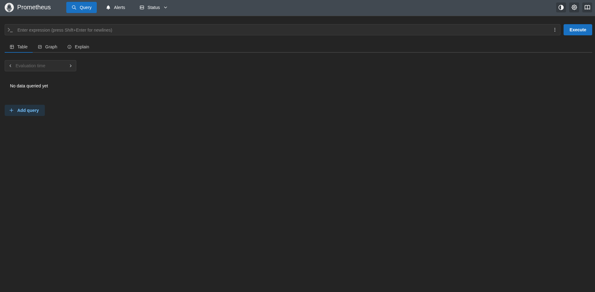
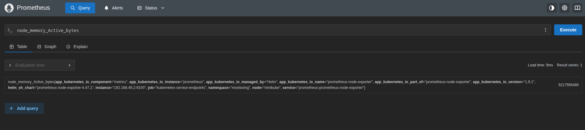
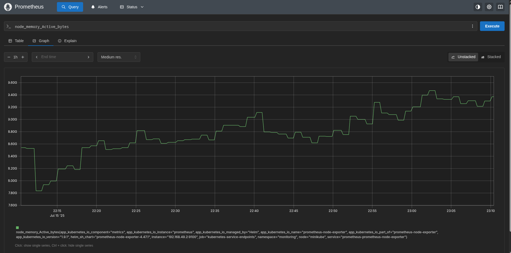
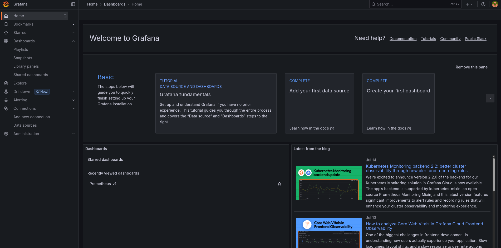
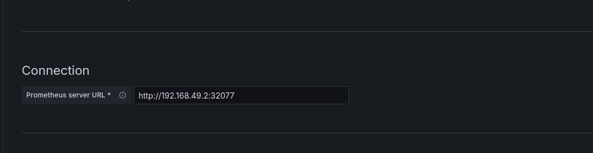
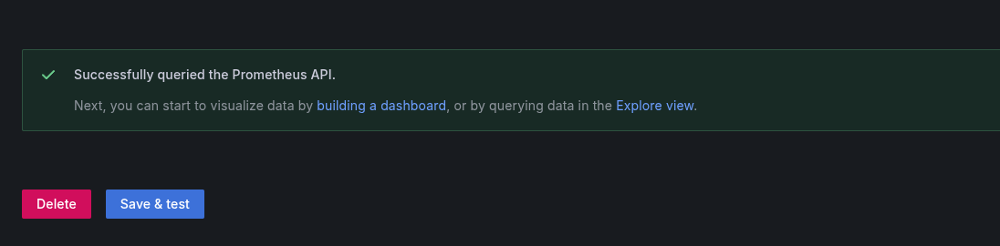
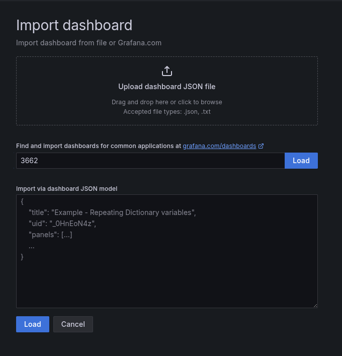
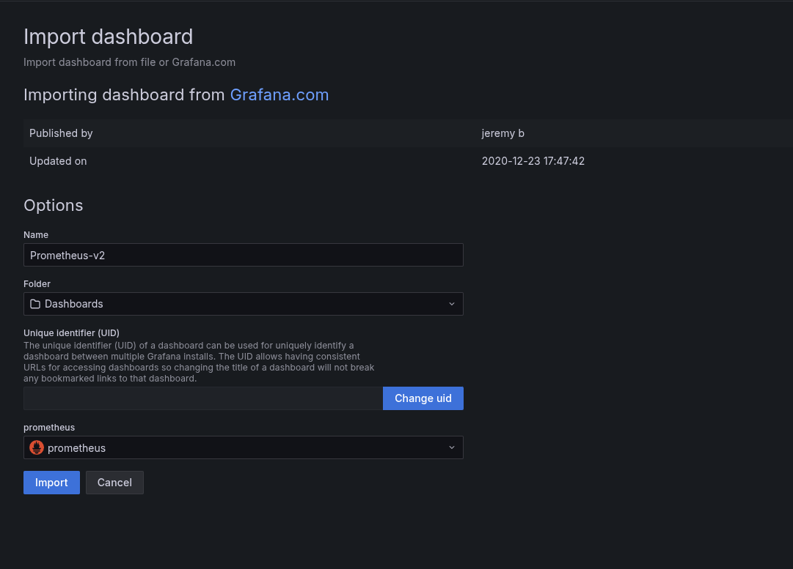
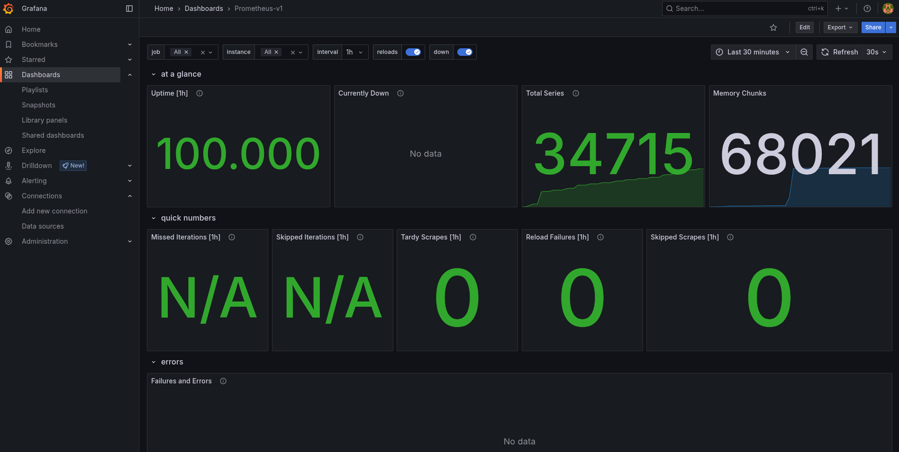

# setup_kubernetes_cluster

Setup a Kubernetes cluster with MongoDB, Mongo Express, Nginx, Prometheus, and Grafana

## Minikube Commands

[Minikube Commands](./docs/minikube_commands.md)

## Add your user to docker group

Create the docker group
```
sudo groupadd docker
```

Add your user to the docker group
```
sudo usermod -aG docker $USER
```

Activate the changes to the group
```
newgrp docker
```

Verify docker commands run without sudo
```
docker run hello-world
```

## Kubctl Commands

[Kubctl Commands](./docs/kubctl_commands.md)

## Useful commands
Create base64 encoded values for credentials
```
echo -n 'username' | base64
echo -n 'password' | base64
```

Copy the values in the secret file (mongodb-secret.yaml)

## Setup the cluster

Start a cluster using Docker. It is recommended to use docker as the driver.
```
minikube start --driver=docker
```

Deploy the Nginx deployment
```
kubectl apply -f deployments/nginx-config.yaml
```

Deploy the Nginx service
```
kubectl apply -f services/nginx-service.yaml
```

Deploy the secret
```
kubectl apply -f secrets/mongodb-secret.yaml
```

Deploy the MongoDB deployment
```
kubectl apply -f deployments/mongodb-config.yaml
```

Deploy the MongoDB service
```
kubectl apply -f services/mongodb-service.yaml
```

Deploy the configmap
```
kubectl apply -f configmaps/mongo-configmap.yaml
```

Deploy Mongo Express deployment
```
kubectl apply -f deployments/mongo-express.yaml
```

Deploy Mongo Express service
```
kubectl apply -f services/mongo-express-service.yaml
```

Create the development namespace
```
kubectl create -f namespaces/namespace-dev.yaml
```

Create the production namespace
```
kubectl create -f namespaces/namespace-prod.yaml
```

Get current context
```
kubectl config current-context
```

In my case, my current context is minikube

Define development context
```
kubectl config set-context dev --namespace=development --cluster=minikube --user=minikube
```

Define production context
```
kubectl config set-context prod --namespace=production --cluster=minikube --user=minikube
```

Deploy the Ingress-Nginx controller
```
helm upgrade --install ingress-nginx ingress-nginx \
  --repo https://kubernetes.github.io/ingress-nginx \
  --namespace ingress-nginx --create-namespace
```

Install the ingress controller via the minikube's addons system
```
minikube addons enable ingress
```

Create the StorageClass for local storage
```
kubectl apply -f storageclasses/fast-storage-storageclass.yaml
```

Create the PersistentVolume and PersistentVolumeClaim for MongoDB
```
kubectl apply -f pv-pvc/mongo-pv-pvc.yaml
```

Generate the mongodb-keyfile via openssl
```
bash -c "openssl rand -base64 756 > keyfiles/mongodb-keyfile"
```

Create Kubernetes secret to store the keyfile
```
kubectl create secret generic mongodb-keyfile --from-file=keyfiles/mongodb-keyfile
```

Apply the StatefulSet to your cluster
```
kubectl apply -f statefulsets/mongo-statefulset.yaml
```

Create the PersistentVolume and PersistentVolumeClaim for storing backups
```
kubectl apply -f pv-pvc/backup-pv-pvc.yaml
```

Create the CronJob for backing up MongoDB automatically using mongodump
```
kubectl apply -f cronjobs/mongodb-backup-cronjob.yaml
```

Create a pod to access backup files
```
kubectl apply -f pods/backup-access.yaml
```

## Default username and password for Mongo Express

username: admin
password: pass

## Ingress-Nginx Controller Setup

[Ingress-Nginx Controller Setup](./docs/ingress-nginx_controller_setup.md)

## firewall-cmd commands

[firewall-cmd commands](./docs/firewall-cmd_commands.md)

## Verify the backup of MongoDB via mongodump works

Get the name of the pod of the mongodb-backup
```
kubectl get pods
```

Verify the backup was created successfully
```
kubectl logs mongodb-backup-29200222-j48wk
```

Access the backup-access pod
```
kubectl exec -it backup-access -- bash
```

Inside the pod, navigate the /backup directory to view the backup files
```
cd /backup
ls
```

## Restore MongoDB via a backup

Go inside the backup-access pod in a terminal
```
kubectl exec -it backup-access -- bash
```

Restore a dumb of MongoDB to recover the database after a failure or crash
```
mongorestore --host=mongodb-service --port 27017 backup/2025-07-08T21-50-01/ --username <your_username> --password <your_password>
```

## Configure replica set for MongoDB

Go to one of the Mongo StatefulSet pods. Usually, you would use the first pod (ex: mongo-sfs-0).
```
kubectl exec -it mongo-sfs-0 -- mongosh
```

Initialize the replica set
```
rs.initiate({
  _id: "rs0",
  members: [
    { _id: 0, host: "mongo-sfs-0.mongo-sfs-service.development.svc.cluster.local:27017", priority: 2 },
    { _id: 1, host: "mongo-sfs-1.mongo-sfs-service.development.svc.cluster.local:27017", priority: 1 },
    { _id: 2, host: "mongo-sfs-2.mongo-sfs-service.development.svc.cluster.local:27017", priority: 1 }
  ]
})
```

To get the hostnames that maps to the pods' IP address for the mongo-sfs-0, mongo-sfs-1, and mongo-sfs-2 pods, use these commands
```
kubectl exec -it mongo-sfs-0 -- bash -c "cat /etc/hosts"
kubectl exec -it mongo-sfs-1 -- bash -c "cat /etc/hosts"
kubectl exec -it mongo-sfs-2 -- bash -c "cat /etc/hosts"
```

Reconfigure the replica set if it had been initialized
```
rs.reconfig({
  _id: "rs0",
  members: [
    { _id: 0, host: "mongo-sfs-0.mongo-sfs-service.development.svc.cluster.local:27017", priority: 2 },
    { _id: 1, host: "mongo-sfs-1.mongo-sfs-service.development.svc.cluster.local:27017", priority: 1 },
    { _id: 2, host: "mongo-sfs-2.mongo-sfs-service.development.svc.cluster.local:27017", priority: 1 }
  ]
},
{
  "force" : true,
  "maxTimeMS" : 0
})
```

To check if the pod is primary, use this command
```
rs.status()
```

## Test failover and recovery processes

Identify the current primary node
```
kubectl exec -it mongo-sfs-0 -- mongosh --eval "rs.status()"
```

Look for the memeber with the stateStr: 'PRIMARY' attribute
```
{
      _id: 0,
      name: 'mongo-sfs-0.mongo-sfs-service.development.svc.cluster.local:27017',
      health: 1,
      state: 1,
      stateStr: 'PRIMARY',
      ...
}
```

Delete the current primary node pod to simulate a failure
```
kubectl delete pod mongo-sfs-0
```

Monitor the status of the replica set. There will be an election of a new primary
```
kubectl exec -it mongo-sfs-1 -- mongosh --eval "rs.status()"
```

You will notice that one of the secondary nodes has been promoted to primary
```
{
      _id: 1,
      name: 'mongo-sfs-1.mongo-sfs-service.development.svc.cluster.local:27017',
      health: 1,
      state: 1,
      stateStr: 'PRIMARY',
      ...
}
```

Verify that the deleted pod has been recreated. The deleted pod will rejoin the replica set as a secondary node:
```
kubectl get pods
```

Confirm that the pod, mongo-sfs-0, is back and running
```
NAME                                  READY   STATUS      RESTARTS      AGE
mongo-sfs-0                           1/1     Running     0             56s
mongo-sfs-1                           1/1     Running     1 (13m ago)   21h
mongo-sfs-2                           1/1     Running     1 (13m ago)   21h
```

Check the replica set status again. You want to make sure that the new node is now re-elected as the primary because
it had the highest priority
```
kubectl exec -it mongo-sfs-0 -- mongosh --eval "rs.status()"
```

You should have something like this
```
{
      _id: 0,
      name: 'mongo-sfs-0.mongo-sfs-service.development.svc.cluster.local:27017',
      health: 1,
      state: 1,
      stateStr: 'PRIMARY',
      ...
}
```

## Add a movie to MongoDB

[Add a movie to MongoDB](./docs/add_a_movie_to_mongodb.md)

## mongosh commands

[mongosh commands](./docs/mongosh_commands.md)

## Configure automatic scaling

Install the Metrics Server
```
kubectl apply -f https://github.com/kubernetes-sigs/metrics-server/releases/latest/download/components.yaml
```

View the status of the metrics server pods
```
kubectl get pods -n kube-system
```

You should see the following
```
NAME                               READY   STATUS    RESTARTS        AGE
...
metrics-server-867d48dc9c-q7dsh    0/1     Running   0               2s
...
```

Containers in the Metrics Server are not running due to TLS certificate issues. To resolve this. execute the command to edit the metrics server deployment
```
kubectl edit deployment metrics-server -n kube-system
```

Add the following commands to the container spec to bypass TLS verification
```
...
spec:
  containers:
  - args:
    ...
    command:
    - /metrics-server
    - --kubelet-insecure-tls
    - --kubelet-preferred-address-types=InternalIP
    image: registry.k8s.io/metrics-server/metrics-server:v0.8.0
...
```

After making changes, confirm that the containers are running by running the command
```
kubectl get pods -n kube-system
```

You should see the following output
```
NAME                               READY   STATUS    RESTARTS        AGE
...
metrics-server-6ccbbf7bbc-bvmg6    1/1     Running   0               2m33s
...
```

Check the resource usage of the pods in the cluster
```
kubectl top pods
```

Here is something you would see
```
NAME                                  CPU(cores)   MEMORY(bytes)
alpine                                0m           1Mi
backup-access                         0m           0Mi
mongo-express-66dc884689-stlzr        1m           125Mi
mongo-sfs-0                           21m          227Mi
mongo-sfs-1                           21m          224Mi
mongo-sfs-2                           21m          233Mi
mongodb-deployment-6d9d7c68f6-mrptm   14m          496Mi
nginx-deployment-5fbdcbb6d5-2rrhq     0m           7Mi
nginx-deployment-5fbdcbb6d5-5qggg     0m           20Mi
```

Define an HPA resource that specifies how and when to scale the MongoDB staefulset using the command
```
kubectl autoscale statefulset mongo-sfs --min=3 --max=10 --cpu-percent=50
```

The configuration will seth the minimum number of replicas to 3 and allow scaling up to a maximum of
10 replicas based on CPU utilization

You should see the following output
```
horizontalpodautoscaler.autoscaling/mongo-sfs autoscaled
```

Monitor the status of the HPA using the command
```
kubectl get hpa
```

This will show you the current status of the HPA which includes the current number of replicas and the metrics used for scaling
```
NAME        REFERENCE               TARGETS        MINPODS   MAXPODS   REPLICAS   AGE
mongo-sfs   StatefulSet/mongo-sfs   cpu: 19%/50%   3         10        3          101s
```

## Set default text editor for kubectl edit

Set default text editor for kubectl edit, add this to ~/.bashrc
```
export KUBE_EDITOR=vim
```

## Setup Monitoring a Cluster with Prometheus and Grafana

### Setup Prometheus

Add the prometheus-community helm chart
```
helm repo add prometheus-community https://prometheus-community.github.io/helm-charts
```

Install kube-prometheus-stack using helm chart
```
helm install kube-prometheus-stack prometheus-community/kube-prometheus-stack
```

Run this command to check to see if it installed correctly
```
kubectl get pods
```

You should see something like this
```
NAME                                                        READY   STATUS      RESTARTS        AGE
alertmanager-kube-prometheus-stack-alertmanager-0           2/2     Running     0               2m1s
...
kube-prometheus-stack-grafana-748cbc5458-rvtht              3/3     Running     0               2m3s
kube-prometheus-stack-kube-state-metrics-684f8c7558-c5lpb   1/1     Running     0               2m3s
kube-prometheus-stack-operator-5cfbc8b784-hn6vg             1/1     Running     0               2m3s
kube-prometheus-stack-prometheus-node-exporter-cvsmx        1/1     Running     0               2m3s
...
prometheus-kube-prometheus-stack-prometheus-0               2/2     Running     0               2m
...
```

Let's take a look at all the services that have been deployed with Prometheus
```
kubectl get service
```

You should see something like this
```
NAME                                             TYPE           CLUSTER-IP       EXTERNAL-IP      PORT(S)                      AGE
alertmanager-operated                            ClusterIP      None             <none>           9093/TCP,9094/TCP,9094/UDP   3m42s
...
kube-prometheus-stack-alertmanager               ClusterIP      10.105.15.245    <none>           9093/TCP,8080/TCP            3m44s
kube-prometheus-stack-grafana                    ClusterIP      10.99.230.183    <none>           80/TCP                       3m44s
kube-prometheus-stack-kube-state-metrics         ClusterIP      10.104.129.206   <none>           8080/TCP                     3m44s
kube-prometheus-stack-operator                   ClusterIP      10.111.227.149   <none>           443/TCP                      3m44s
kube-prometheus-stack-prometheus                 ClusterIP      10.101.147.184   <none>           9090/TCP,8080/TCP            3m44s
kube-prometheus-stack-prometheus-node-exporter   ClusterIP      10.96.23.75      <none>           9100/TCP                     3m44s
...
prometheus-operated                              ClusterIP      None             <none>           9090/TCP                     3m41s
```

Port forward to 9090 to get the Prometheus UI
```
kubectl port-forward prometheus-kube-prometheus-stack-prometheus-0 9090
```

Apply the config for the prometheus-server-ext-service service
```
kubectl apply -f services/prometheus-server-ext-service.yaml
```

Run the command to see a new entry called prometheus-server-ext-service.
```
kubectl get service
```

You should see something like this:
```
NAME                                  TYPE        CLUSTER-IP       EXTERNAL-IP   PORT(S)        AGE
...
prometheus-server-ext-service         NodePort       10.98.119.17     <none>           80:30517/TCP                 7s
```

Run the command to get the IP address of the node
```
minikube ip
```

Go to this link to access the Prometheus Server UI. The URL consists of the IP address of the node and
the port of the prometheus-server-ext service. In my case, the url is http://192.168.49.2:30517.

This is what Prometheus UI looks like



#### Queries in Prometheus UI

Type the `node_memory_Active_bytes` metric, which gets the memory consumption of each of the Nodes in the cluster. Press the Execute button to run the query. The results will be displayed in a table that shows the query's raw output:



Switch to the Graph tab to see the visualization of the metric over time.



### Setup Grafana

Add the grafana helm chart
```
helm repo add grafana https://grafana.github.io/helm-charts
```

Run the command to get admin user password
```
kubectl --namespace development get secrets kube-prometheus-stack-grafana -o jsonpath="{.data.admin-password}" | base64 -d ; echo
```

Run the command get the Grafana URL to visit
```
kubectl port-forward deployment/kube-prometheus-stack-grafana 3000
```

Run the command to see the Grafana service
```
kubectl get service
```

You should see something like this
```
NAME                                             TYPE           CLUSTER-IP       EXTERNAL-IP      PORT(S)                      AGE
...
kube-prometheus-stack-grafana                    ClusterIP      10.99.230.183    <none>           80/TCP                       33m
...
```

Apply the grafana-ext-service service
```
kubectl apply -f services/grafana-ext-service.yaml
```

Run the command to see a new entry called grafana-ext-service
```
kubectl get service
```

You should see something like this
```
NAME                                  TYPE           CLUSTER-IP       EXTERNAL-IP      PORT(S)                      AGE
...
grafana-ext-service                   NodePort       10.108.112.252   <none>           80:31825/TCP                 3h27m
...
```

Go to this link to access the Grafana dashboard. The URL consists of the IP address of the node and
the port of the grafana-ext service. In my case, the url is http://192.168.49.2:31825.

This is what the Grafana home page looks like



#### Configure monitoring applications

You got to create Prometheus as a data source for Grafana. This allows Grafana to retrieve metrics from Prometheus to create
the graphs that will be used to visualize cluster metrics.

Create the first dashboard tile. Then from the list of options presented, select Prometheus.

Add the URL for the Prometheus server URL field
```
http://192.168.49.2:30517
```



Save and test to see it works. This will save the configuration and test if the data source is working.



Let's create a dashboard to visualize the data, go to the menu and select "Dashboards".

To do this, input the ID of the dashboard into the text field. The ID being used is 3662. Click the Load button.



Set the name for the dashboard to Prometheus-v1 and set the Prometheus option for the Data Source.



Select import and you will see the dashboard that has been generated.



This retrieves information from the Minikube cluster. The dashboard has a predefined template that runs queries
(PromQL quereis). These queries run against the cluster and provides these metrics.

## helm commands

[helm commands](./docs/helm_commands.md)

## Setup the Prometheus MongoDB Exporter

See all configurable options, run the command
```
helm show values prometheus-community/prometheus-mongodb-exporter
```

Install the Prometheus MongoDB Exporter
```
helm install prometheus-mongodb-exporter prometheus-community/prometheus-mongodb-exporter -f mongodb-exporter/values.yaml
```

Uninstall the Prometheus MongoDB Exporter if something is wrong
```
helm uninstall prometheus-mongodb-exporter
```

Make sure the prometheus-mongodb-exporter pod is available
```
kubectl get pod
```

You should see something like this
```
NAME                                                     READY   STATUS    RESTARTS       AGE
...
prometheus-mongodb-exporter-5cf876c6d9-5djmh             1/1     Running   0              94s
...
```

Make sure the prometheus-mongodb-exporter service is available
```
kubectl get service
```

You should see something like this
```
NAME                                             TYPE           CLUSTER-IP       EXTERNAL-IP      PORT(S)                      AGE
...
prometheus-mongodb-exporter                      ClusterIP      10.96.130.12     <none>           9216/TCP                     15m
...
```

Make sure that the prometheus-mongodb-exporter service monitor is available
```
kubectl get servicemonitor
```

You should see something like this
```
NAME                                                 AGE
prometheus-mongodb-exporter                          2s
...
```

Verify the application is working by running these commands

Port forward the prometheus-mongodb-exporter service
```
kubectl port-forward service/prometheus-mongodb-exporter 9216
```

Curl the metrics of the Prometheus MongoDB Exporter
```
curl http://127.0.0.1:9216/metrics
```

To access the Prometheus MongoDB Exporter, apply the prometheus-mongodb-exporter-ext-service service config
```
kubectl apply -f services/prometheus-mongodb-exporter-ext-service.yaml
```

Check for the prometheus-mongodb-exporter-ext-service service
```
kubectl get service
```

You should see something like this
```
NAME                                             TYPE           CLUSTER-IP       EXTERNAL-IP      PORT(S)                      AGE
...
prometheus-mongodb-exporter-ext-service          NodePort       10.110.114.113   <none>           80:30560/TCP                 8m33s
...
```

### Setup the MongoDB Dashboard in Grafana

Go to Import dashboard page.

Enter the ID 7353 and load it.

Set the name for the dashboard to MongoDB-v1 and set the Prometheus option for the Data Source.

Select import and you will see the dashboard that has been generated.

## Resources
* [Kubernetes Documentation](https://kubernetes.io/docs/home/)
  * [Viewing Pods and Nodes](https://kubernetes.io/docs/tutorials/kubernetes-basics/explore/explore-intro/)
  * [Run a Stateless Application Using a Deployment](https://kubernetes.io/docs/tasks/run-application/run-stateless-application-deployment/)
  * [Namespaces Walkthrough](https://kubernetes.io/docs/tutorials/cluster-management/namespaces-walkthrough/)
* [Linux post-installation steps for Docker Engine](https://docs.docker.com/engine/install/linux-postinstall/)
* [mongo-express Docker image](https://hub.docker.com/_/mongo-express)
* [Installation Guide - Ingress-Nginx Controller](https://kubernetes.github.io/ingress-nginx/deploy/)
* [Ensuring High Availability for MongoDB on Kubernetes - MongoDB](https://www.mongodb.com/developer/products/mongodb/mongodb-with-kubernetes/)
* [How to Create a Database in MongoDB - MongoDB](https://www.mongodb.com/resources/products/fundamentals/create-database)
* [How To Use the MongoDB Shell - DigitalOcean](https://www.digitalocean.com/community/tutorials/how-to-use-the-mongodb-shell)
* [Delete Documents - MongoDB](https://www.mongodb.com/docs/mongodb-shell/crud/delete/)
* [db.collection.drop() (mongosh method) - MongoDB](https://www.mongodb.com/docs/manual/reference/method/db.collection.drop/)
* [db.dropDatabase() (mongosh method) - MongoDB](https://www.mongodb.com/docs/manual/reference/method/db.dropDatabase/)
* [deleting minikube cluster so I can create a larger cluster with more CPUs - Stack Overflow](https://stackoverflow.com/questions/72147700/deleting-minikube-cluster-so-i-can-create-a-larger-cluster-with-more-cpus#:~:text=I%20run%20minikube%20with%20--,294)
* [Basic controls - minikube](https://minikube.sigs.k8s.io/docs/handbook/controls/)
* [Kubernetes Metrics Server](https://kubernetes-sigs.github.io/metrics-server/)
* [Monitoring a Kubernetes Cluster using Prometheus and Grafana - Medium](https://medium.com/@akilblanchard09/monitoring-a-kubernetes-cluster-using-prometheus-and-grafana-8e0f21805ea9)
* [prometheus-community/helm-charts GitHub repository](https://github.com/prometheus-community/helm-charts)
* [grafana/helm-charts GitHub repository](https://github.com/grafana/helm-charts)
* [Prometheus Monitoring for Kubernetes Cluster [Tutorial] - spacelift](https://spacelift.io/blog/prometheus-kubernetes)
* [prometheus-community/prometheus-mongodb-exporter - Artifact Hub](https://artifacthub.io/packages/helm/prometheus-community/prometheus-mongodb-exporter)
* [kube-prometheus-stack - prometheus-community/helm-charts GitHub repository](https://github.com/prometheus-community/helm-charts/tree/main/charts/kube-prometheus-stack)
* [How To Monitor MongoDB with Grafana and Prometheus on Ubuntu 20.04 - DigitalOcean](https://www.digitalocean.com/community/tutorials/how-to-monitor-mongodb-with-grafana-and-prometheus-on-ubuntu-20-04)
