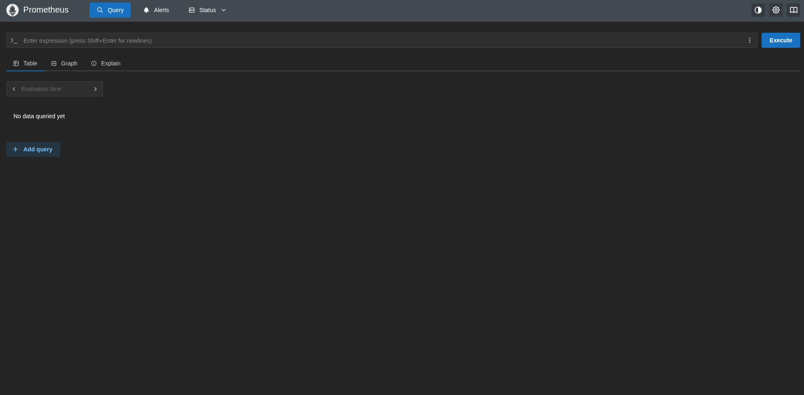
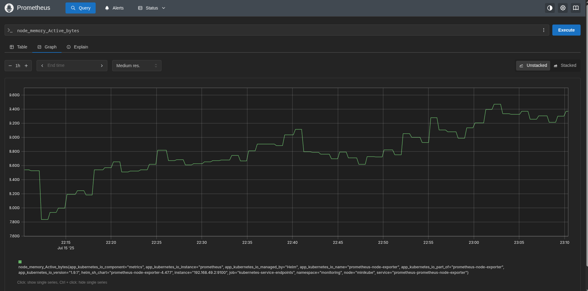
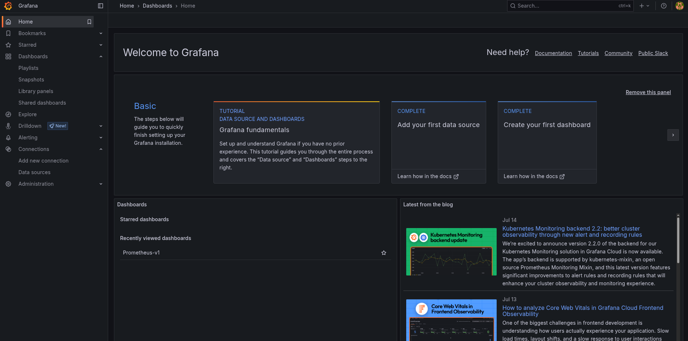
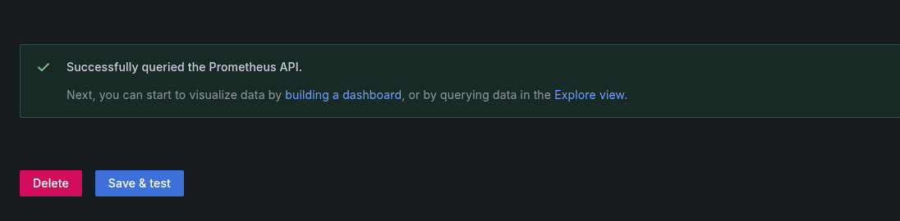
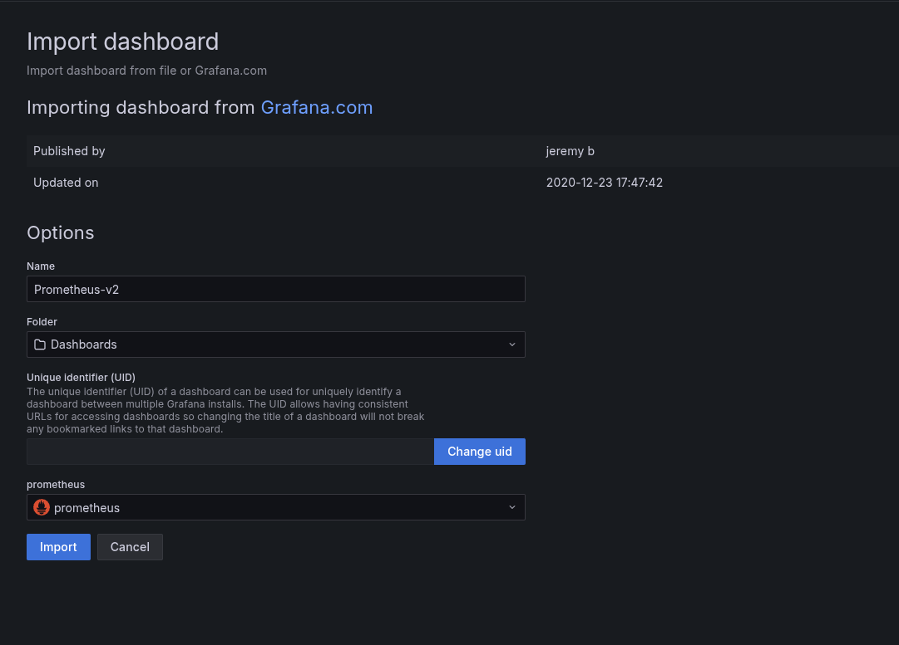

# Setup Monitoring a Cluster with Prometheus and Grafana

## Setup Prometheus

Add the prometheus-community helm chart
```
helm repo add prometheus-community https://prometheus-community.github.io/helm-charts
```

Install kube-prometheus-stack using helm chart
```
helm install kube-prometheus-stack prometheus-community/kube-prometheus-stack
```

Run this command to check to see if it installed correctly
```
kubectl get pods
```

You should see something like this
```
NAME                                                        READY   STATUS      RESTARTS        AGE
alertmanager-kube-prometheus-stack-alertmanager-0           2/2     Running     0               2m1s
...
kube-prometheus-stack-grafana-748cbc5458-rvtht              3/3     Running     0               2m3s
kube-prometheus-stack-kube-state-metrics-684f8c7558-c5lpb   1/1     Running     0               2m3s
kube-prometheus-stack-operator-5cfbc8b784-hn6vg             1/1     Running     0               2m3s
kube-prometheus-stack-prometheus-node-exporter-cvsmx        1/1     Running     0               2m3s
...
prometheus-kube-prometheus-stack-prometheus-0               2/2     Running     0               2m
...
```

Let's take a look at all the services that have been deployed with Prometheus
```
kubectl get service
```

You should see something like this
```
NAME                                             TYPE           CLUSTER-IP       EXTERNAL-IP      PORT(S)                      AGE
alertmanager-operated                            ClusterIP      None             <none>           9093/TCP,9094/TCP,9094/UDP   3m42s
...
kube-prometheus-stack-alertmanager               ClusterIP      10.105.15.245    <none>           9093/TCP,8080/TCP            3m44s
kube-prometheus-stack-grafana                    ClusterIP      10.99.230.183    <none>           80/TCP                       3m44s
kube-prometheus-stack-kube-state-metrics         ClusterIP      10.104.129.206   <none>           8080/TCP                     3m44s
kube-prometheus-stack-operator                   ClusterIP      10.111.227.149   <none>           443/TCP                      3m44s
kube-prometheus-stack-prometheus                 ClusterIP      10.101.147.184   <none>           9090/TCP,8080/TCP            3m44s
kube-prometheus-stack-prometheus-node-exporter   ClusterIP      10.96.23.75      <none>           9100/TCP                     3m44s
...
prometheus-operated                              ClusterIP      None             <none>           9090/TCP                     3m41s
```

Port forward to 9090 to get the Prometheus UI
```
kubectl port-forward prometheus-kube-prometheus-stack-prometheus-0 9090
```

Apply the config for the prometheus-server-ext-service service
```
kubectl apply -f services/prometheus-server-ext-service.yaml
```

Run the command to see a new entry called prometheus-server-ext-service.
```
kubectl get service
```

You should see something like this:
```
NAME                                  TYPE        CLUSTER-IP       EXTERNAL-IP   PORT(S)        AGE
...
prometheus-server-ext-service         NodePort       10.98.119.17     <none>           80:30517/TCP                 7s
```

Run the command to get the IP address of the node
```
minikube ip
```

Go to this link to access the Prometheus Server UI. The URL consists of the IP address of the node and
the port of the prometheus-server-ext service. In my case, the url is http://192.168.49.2:30517.

This is what Prometheus UI looks like



### Queries in Prometheus UI

Type the `node_memory_Active_bytes` metric, which gets the memory consumption of each of the Nodes in the cluster. Press the Execute button to run the query. The results will be displayed in a table that shows the query's raw output:


Switch to the Graph tab to see the visualization of the metric over time.



## Setup Grafana

Run the command to get admin user password
```
kubectl --namespace development get secrets kube-prometheus-stack-grafana -o jsonpath="{.data.admin-password}" | base64 -d ; echo
```

Run the command get the Grafana URL to visit
```
kubectl port-forward deployment/kube-prometheus-stack-grafana 3000
```

Run the command to see the Grafana service
```
kubectl get service
```

You should see something like this
```
NAME                                             TYPE           CLUSTER-IP       EXTERNAL-IP      PORT(S)                      AGE
...
kube-prometheus-stack-grafana                    ClusterIP      10.99.230.183    <none>           80/TCP                       33m
...
```

Apply the grafana-ext-service service
```
kubectl apply -f services/grafana-ext-service.yaml
```

Run the command to see a new entry called grafana-ext-service
```
kubectl get service
```

You should see something like this
```
NAME                                  TYPE           CLUSTER-IP       EXTERNAL-IP      PORT(S)                      AGE
...
grafana-ext-service                   NodePort       10.108.112.252   <none>           80:31825/TCP                 3h27m
...
```

Go to this link to access the Grafana dashboard. The URL consists of the IP address of the node and
the port of the grafana-ext service. In my case, the url is http://192.168.49.2:31825.

This is what the Grafana home page looks like



### Configure monitoring applications

You got to create Prometheus as a data source for Grafana. This allows Grafana to retrieve metrics from Prometheus to create
the graphs that will be used to visualize cluster metrics.

Create the first dashboard tile. Then from the list of options presented, select Prometheus.

Add the URL for the Prometheus server URL field
```
http://192.168.49.2:30517
```


Save and test to see it works. This will save the configuration and test if the data source is working.



Let's create a dashboard to visualize the data, go to the menu and select "Dashboards".

To do this, input the ID of the dashboard into the text field. The ID being used is 3662. Click the Load button.


Set the name for the dashboard to Prometheus-v1 and set the Prometheus option for the Data Source.



Select import and you will see the dashboard that has been generated.


This retrieves information from the Minikube cluster. The dashboard has a predefined template that runs queries
(PromQL quereis). These queries run against the cluster and provides these metrics.